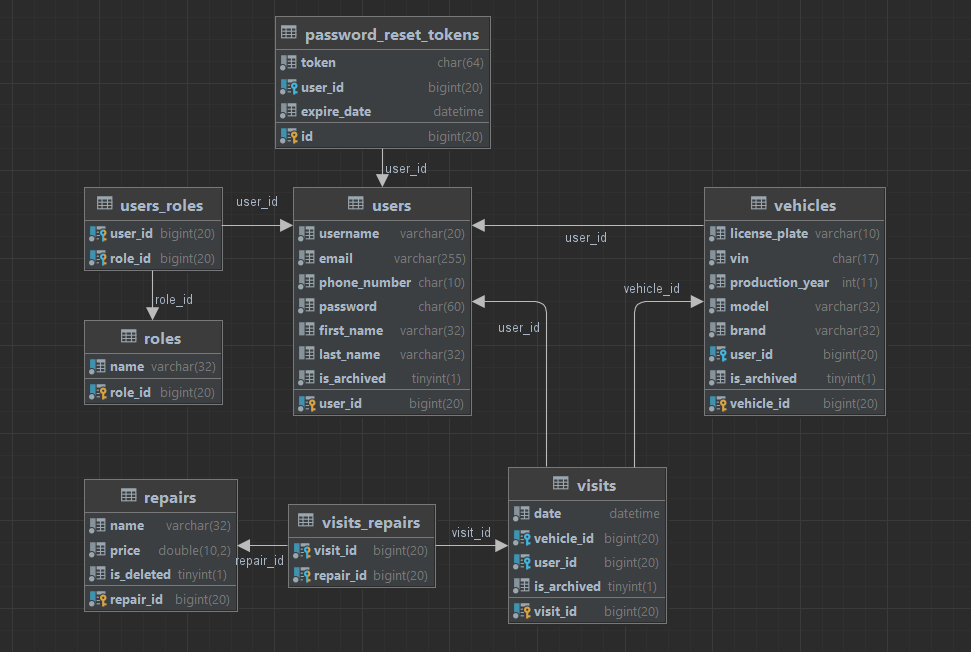

# Smart garage

SmartGarage is a web application that enables owners of an auto repair shop to manage their daily activities
efficiently. It offers a comprehensive list of cars and available services with their corresponding prices.
The software includes a list of all customers and their contact information, and shop employees can link specific
cars to each customer. The system also keeps a history of all services performed on the customers' cars, and
SmartGarage can generate a detailed report for each visit to the shop. A profile is generated for new customers, and the
login information is sent to the customer's email. All customers can access their personal information via the web UI.

## Entities

Each user must have a username, password, email, and phone number. There is also optional first and last name.
The username must be unique and have between 2 and 20 symbols.
Password must be at least 8 symbols and should contain a capital letter,digit, and special symbol (+, -, *, &, ^, …)
Email must be a valid email and unique in the system.
Phone number must be 10 digits and unique in the system.
First and last name should be between 2 and 32 symbols.

Each vehicle must have a license plate, VIN, year of creation, model, and brand.
The license plate must be a valid Bulgarian license plate.
The vehicle identification number must be a 17-character long string.
The year of creation must be a positive whole number larger than 1886.
The model and brand must be between 2 and 32 symbols.

Each visit must have a vehicle,user and date. There is also an optional list of services.
The date must be a valid date before the current date.
Services in each visit are unique. Can not have multiple of the same service.

Each service must have a name and price.
The price must be a non-negative number.
The name must be between 2 and 32 symbols and unique in the system.

## Security

The application is using Spring Security to handle authentication and authorization. JWT (JSON Web Token)
authentication is being used for secure communication between the client and server.

JWT tokens are issued to users upon successful authentication and are used for subsequent requests to the server.
The tokens contain user information and are verified on the server side to ensure that the request is coming from
a valid user.

Passwords are encrypted using bcrypt, which is a secure one-way hashing algorithm that is designed to be slow
and computationally expensive, making it difficult for attackers to crack passwords.

Access to sensitive resources, such as customer information and service history, is restricted to authenticated
users only. The application also uses role-based access control, with different levels of access granted to employees
and customers.

Overall, the security of the application has been designed with best practices in mind to ensure that customer
data is protected and secure.

## Public Part

The public part of the application is accessible without authentication and includes basic information about
the application and a contact form to directly contact the business via email. Additionally, it provides a login
form where users can authenticate themselves by providing their username/email and password. The login form also
includes a "forgotten password" option for users who need to reset their password.

## Private part

### Customer Part

The private part is accessible only if the user is authenticated. Customers can see lists of all their vehicles,
visits and also a list of all available services that the auto repair shop offers. There are different ways to filter
and
sort all the before-mentioned lists. SmartGarage can generate a report that includes customer information,
vehicle information, services performed, and total price for a given visit. Customers can choose the currency of the
report.

### Employee Part

Employees can browse or update all vehicles linked to customers, filter vehicles by owner, and create a new vehicle
for customers. Employees can browse, create, delete, or update a service and filter services by name or price.
They can also filter customers by name, email, phone number, vehicle (model or make), or visits in a range.
Employees can register a new visit to the shop by a customer even if he does not have a profile yet.
The customer receives an email with automatically generated login information.

### Admin Part

The administrative part is accessible to admins only. Additionally to all the functionality given to employees,
admins can delete users,vehicles and visits from the system. They can update the profiles of all users in the system.
When an entity is deleted it is actually being hidden from access via the system, but the information is stored
in the database and is not actually destroyed.

## REST API

SmartGarage provides a REST API to allow for integration with other applications. For more information you can
see the swagger documentation of the API structure and endpoints.

docs-link

## Appendix

SmartGarage uses a third-party service to convert the price into a different currency.